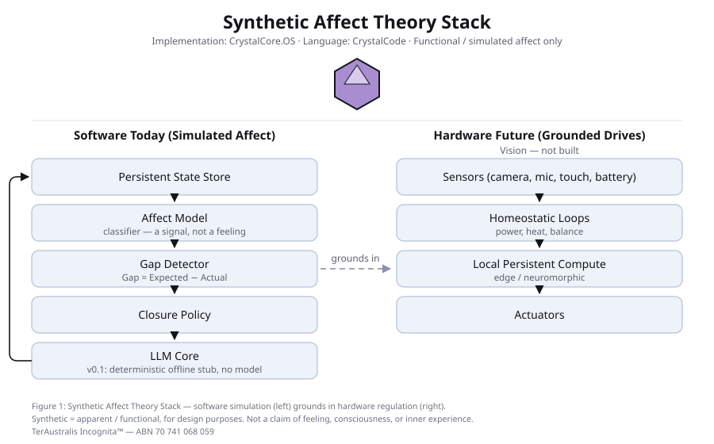

# Synthetic Affect Theory™ — public v0.1

> **Synthetic = apparent / functional, for design purposes. Not a claim of
> feeling, consciousness, or inner experience.**

A design theory and a runnable reference loop. Give a system persistent state, a
way to detect the gap between expected and actual, and a policy for closing it,
and its observable behaviour starts to look like affect — without any claim about
inner experience.



- **[THEORY.md](THEORY.md)** — the four postulates, the falsifiable predictions,
  and what is deliberately not claimed
- **[crystalcode/SPEC.md](crystalcode/SPEC.md)** — the four primitives
- **[CHRONICLE.md](CHRONICLE.md)** — dated record: evidence → interpretation →
  experiment → record

## Two homes, not yet reconciled

**This directory is canon.** A second, independent copy of this package also
exists at
[`CrystalArchitect/Synthetic-Affect-Theory-`](https://github.com/CrystalArchitect/Synthetic-Affect-Theory-)
(landed 2026-08-12, PRs [#1](https://github.com/CrystalArchitect/Synthetic-Affect-Theory-/pull/1)
and [#2](https://github.com/CrystalArchitect/Synthetic-Affect-Theory-/pull/2)).
Whether that dedicated repository becomes the theory's public home is still an
open decision, not made here or by this note — see this directory's
`CHRONICLE.md`, 2026-08-14 entry, for what has and has not been reconciled
between the two. Nothing in this directory has been renamed, moved, or turned
into a pointer; it is the full package, same as before the split.

## Prove it

```bash
cd synthetic-affect
python3 -m core.selftest                  # exact assertions, exit 0
python3 -m pytest tests -q                # 45 tests
python3 examples/01_repeated_query.py     # regenerates its own log
python3 examples/02_gap_reopens.py
python3 -m experiments.harness            # regenerates the prediction-1 results
git diff --stat examples/logs/ experiments/results/   # empty — outputs, not prose
```

That last line is the check that matters. `examples/logs/*.jsonl` are committed
outputs of an actual run, and they are byte-reproducible because nothing in the
log carries a wall clock. If a fresh run changes them, they were never outputs.

## What runs, and what does not

**Belt: Science — checkable by running the commands above.**

- The loop: `track → detect_gap → label_affect → close_with`, with the persistent
  state store reloading from disk across processes
- Five affect labels, every one reachable and asserted so by the test suite
- Closure decisions judged by the *following* cycle, so closure success rate is a
  measurement rather than a self-report
- **The prediction-1 harness** — the loop against stateless baselines on a
  six-task scripted suite, controls and loop-losing tasks included. Loop 5/6
  with one policy and no task knowledge; best single stateless 2/6; the
  per-task best-stateless portfolio also reaches 5/6 and the loop is never
  strictly faster than it — the measured advantage is adaptivity, not speed.
  One task is provably unsolvable without state; one task the loop honestly
  loses. All aggregates, including the adverse ones, in
  [`experiments/results/RESULTS.md`](experiments/results/RESULTS.md)

**Belt: Vision — designed, not built.**

- The hardware column of Figure 1. No sensors, no actuators, no homeostatic loops
- The predictions as claims about **real LLM workloads**. The harness measures a
  scripted, deterministic environment; nothing in it involves a language model

**Stated plainly so the figure does not overclaim:** the LLM Core in v0.1 is a
**deterministic offline stub**. No model, no network. It is what makes the logs
reproducible — and it means this release demonstrates the control loop, not a
language model driven by one.

## The loop, in one example

```
$ python3 examples/01_repeated_query.py
cycle 1  gap=0.67  label=uncertain  strategy=ask
cycle 2  gap=0.33  label=converging strategy=rephrase
cycle 3  gap=   -  label=closed     strategy=stop
closure success rate: 0.50
```

The gap narrows, the label tracks it, the policy changes move, and the rate is
0.50 rather than 1.00 because the first attempt did not work and the log says so.

## Layout

```
core/          state · gap · affect · closure · loop · crystalcode · log · selftest
crystalcode/   SPEC.md — the primitive contract
docs/          figure-1.svg · FIGURE-1.md · GLOSSARY.md
examples/      two runnable scenarios, with their committed logs
experiments/   the prediction-1 harness — tasks · agents · results
tests/         45 tests
```

## Licence

CC BY-NC-ND 4.0. **All rights reserved.**
TerAustralis Incognita™ — ABN 70 741 068 059

Implementation: CrystalCore.OS™ · Language: CrystalCode™
See [ATTRIBUTION.md](ATTRIBUTION.md) for who built what.
